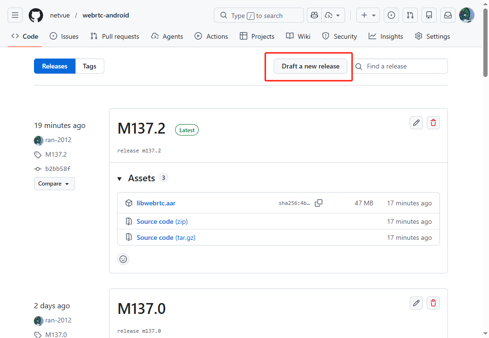
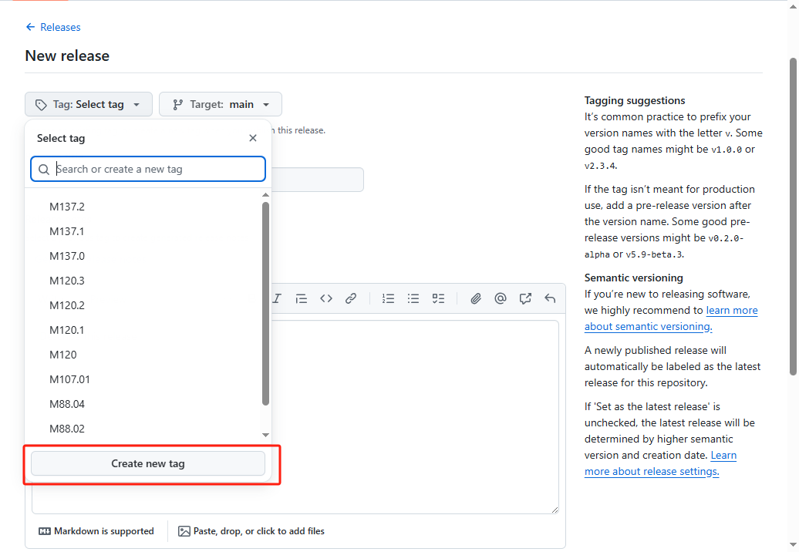
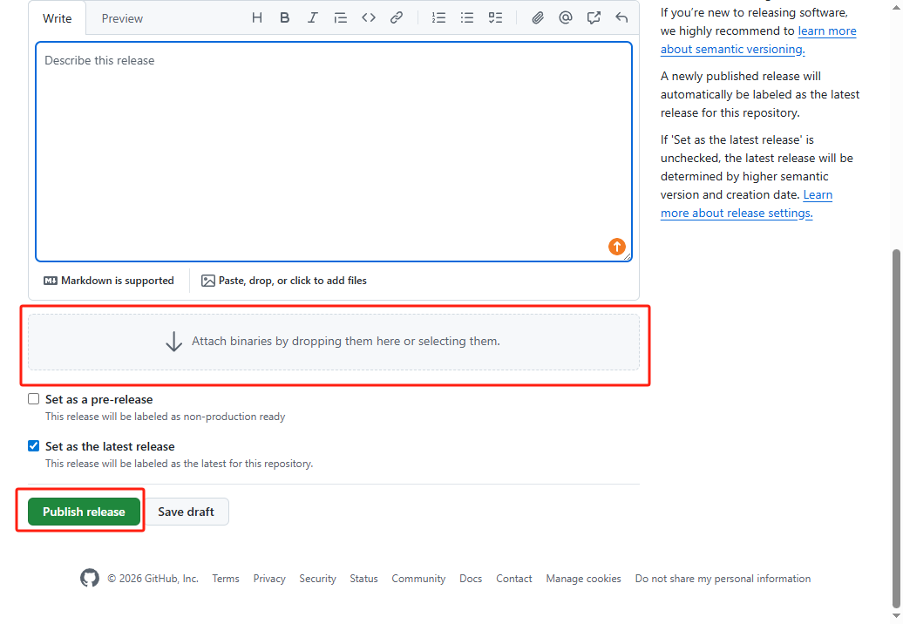
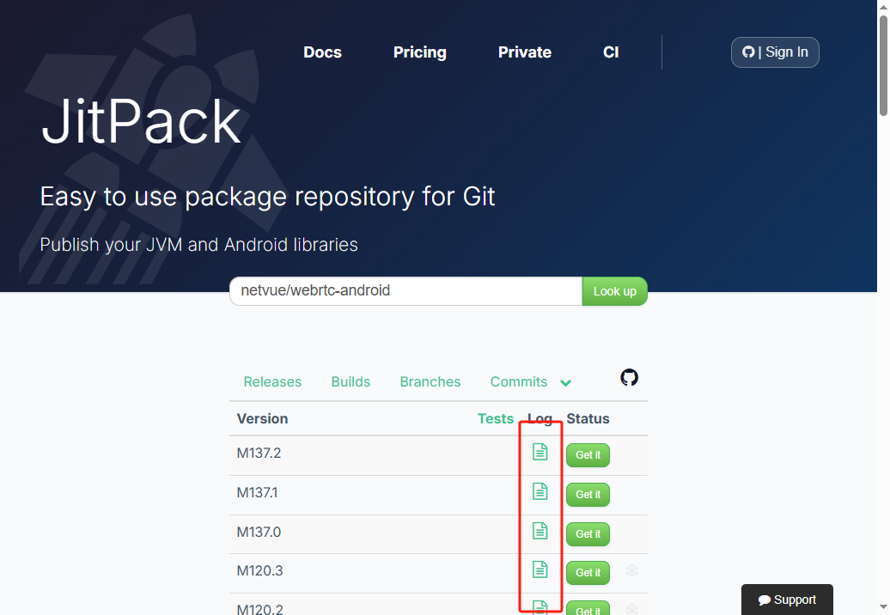

# 如何使用JitPack+Github发布WebRTC Android SDK

## 修改脚本

- 假设你已经编译出来了`libwebrtc.aar`，
- **先不要上传到Github**
- 首先你需要改`custom_setup.sh`中的`VERSION`:

```bash
VERSION=M137.2
```

- version名最好和官方的版本一致，比如M137的版本基于官方的M137版本修改
- 后边的子版本号按顺序递增即可，比如M137.1、M137.2等
- 修改完成脚本后push到Github仓库上

## 上传AAR

- 在Github上创建一个Release，你可能需要权限
- 在Release点击"Draft a new release"

- 选择一个tag，注意这个tag必须和你在`custom_setup.sh`中设置的版本号一致，比如M137.2

- 最后上传你的`libwebrtc.aar`，并发布这个Release


## 查看JitPack发布结果

- 访问JitPack，[JitPack](https://jitpack.io/#netvue/webrtc-android)
- 你可以看到所有的版本发布信息
- JitPack需要一定时间来上传你的AAR，你可以在每个版本的右侧看到构建日志
